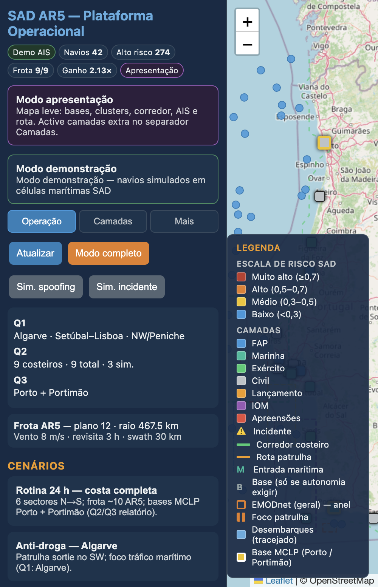
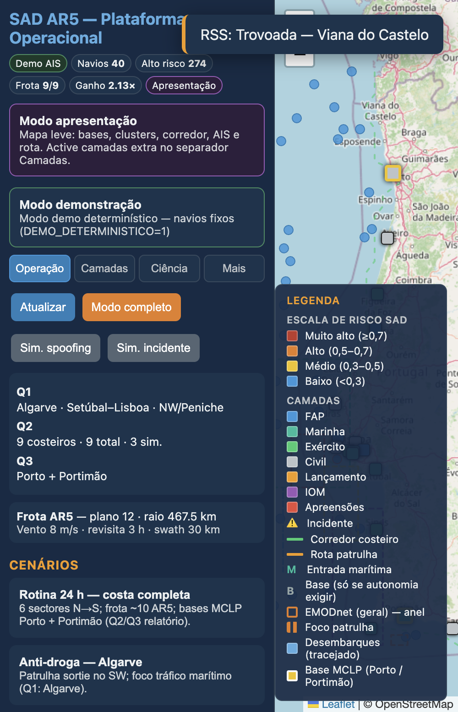
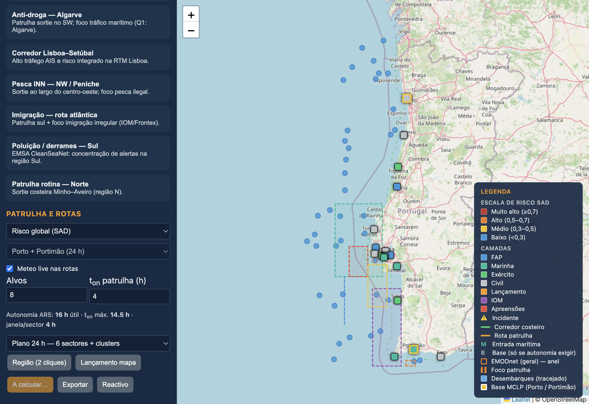
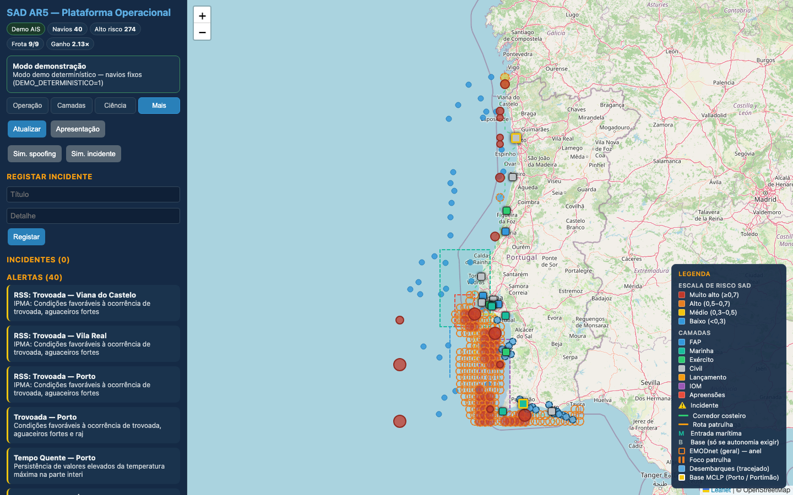
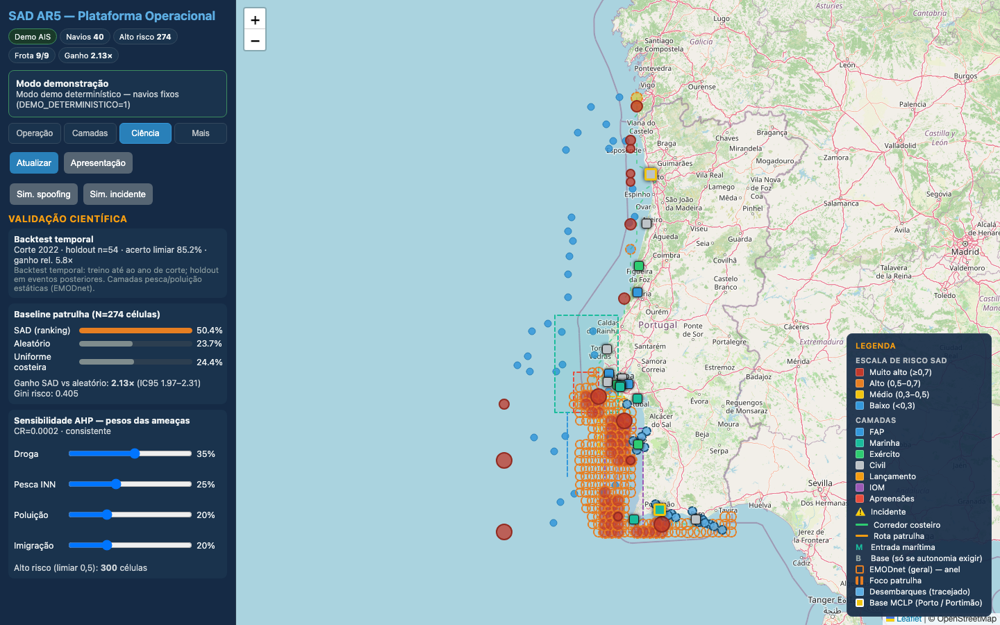
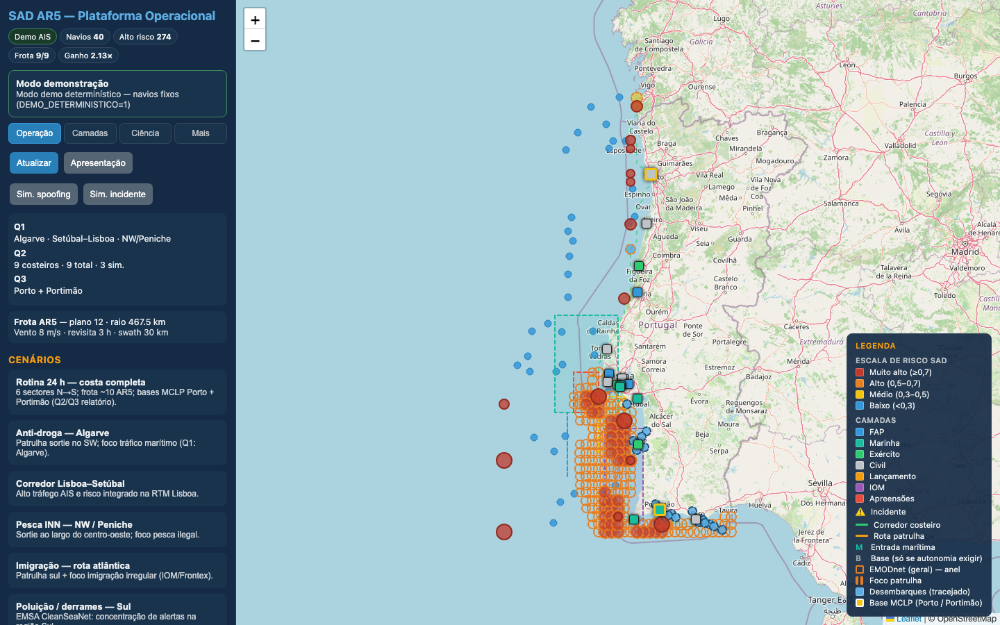

# SAD AR5 — Plataforma operacional

Protótipo web quasi-tempo-real para apoio à vigilância costeira com o UAV TEKEVER AR5:
mapa de risco, meteo, AIS, rotas de patrulha, plano 24 h, dimensionamento de frota, alertas e painel de validação científica (backtest, baseline, sensibilidade AHP).

**Repositório:** https://github.com/MakaG222/sad-ar5-vigilancia-costeira  
**Entrega final:** tag [`v1.0-final`](https://github.com/MakaG222/sad-ar5-vigilancia-costeira/releases/tag/v1.0-final)




*Capturas em resolução 1440×900. Se alguma imagem aparecer cortada no browser, abra o ficheiro diretamente em `plataforma/docs/`.*

---

## Relatório académico

O **relatório escrito (Word/PDF) não está neste repositório**. Este GitHub contém apenas a **plataforma executável** e o **núcleo analítico** (`src/`, `dados/`, `resultados/`).

O relatório é entregue em separado (ficheiro local ou plataforma da Escola Naval). Os ficheiros `*.docx` e `*.pdf` na raiz estão listados em [`.gitignore`](.gitignore) de forma intencional — não serão versionados aqui.

---

## Perguntas SAD — respostas finais

| Pergunta | Resposta |
|----------|----------|
| **Q1 — Onde patrulhar?** | Sul/SW (Algarve), corredor Lisboa–Setúbal e NW/Peniche; imigração reforçada no Algarve; corredores AIS a O de Lisboa. |
| **Q2 — Quantos AR5?** | **9 AR5** para vigilância persistente 24 h na faixa costeira (3 simultâneos), com bases em Santa Cruz, Cascais, Sines, Portimão e Faro. |
| **Q3 — Onde colocar bases?** | **MCLP (k=2): Porto (Sá Carneiro) + Portimão** — cobrem 100 % do risco alto com o mínimo de instalações. |

Fonte canónica: [`resultados/validacao.json`](resultados/validacao.json) → `resposta_objetivo`.  
Nota metodológica: Q3 é a **localização mínima** (MCLP); Q2 usa a **rede costeira distribuída** para o dimensionamento de frota. Com apenas Porto + Portimão seriam necessários **10 AR5**.

---

## Capturas da plataforma

<p align="center">
  
</p>

<p align="center"><em>Mapa de risco e respostas SAD (modo completo — todas as camadas)</em></p>

<p align="center">
  
</p>

<p align="center"><em>Plano 24 h — 6 sectores com rotas calculadas</em></p>

<p align="center">
  
</p>

<p align="center"><em>Alertas operacionais (meteo, RSS, cobertura)</em></p>

<p align="center">
  
</p>

<p align="center"><em>Validação científica — backtest e baseline patrulha</em></p>

<p align="center">
  
</p>

<p align="center"><em>Dimensionamento de frota AR5 e métricas Q1–Q3</em></p>

---

## Limitações

- **AIS e meteo** podem operar em modo *demo* ou *fallback* local quando não há ligação à Internet ou chave AISStream (`AISSTREAM_API_KEY`). O modo determinístico (`DEMO_DETERMINISTICO=1`, activo por omissão no Docker) fixa navios e meteo para apresentações reprodutíveis.
- O **modelo de risco** depende da qualidade e resolução dos dados históricos (EMODnet, UNODC, IOM, desembarques PT). Camadas de pesca e poluição são estáticas no backtest temporal por ausência de série anual nas fontes abertas.
- O índice SAD é **apoio à decisão**, não previsão absoluta de incidentes: indica *onde* concentrar esforço de patrulha com base em padrões passados e proxies geoespaciais, sujeito a incerteza operacional e evolução do fenómeno.

---

## Arranque rápido

> **Windows sem Git?** Não use o Prompt de Comandos (CMD) para os scripts `.ps1`.  
> Guia completo: [`plataforma/ARRANQUE-WINDOWS.md`](plataforma/ARRANQUE-WINDOWS.md) — descarregar o [ZIP da release](https://github.com/MakaG222/sad-ar5-vigilancia-costeira/releases/download/v1.0-final/sad-ar5-v1.0-final.zip), abrir **PowerShell** e seguir os passos.

### Docker (recomendado)

```bash
git clone https://github.com/MakaG222/sad-ar5-vigilancia-costeira.git
cd sad-ar5-vigilancia-costeira/plataforma
chmod +x start-docker.sh stop-docker.sh
./start-docker.sh
```

→ **http://localhost:8080**

Parar: `./stop-docker.sh`

### macOS / Windows (desenvolvimento)

| Sistema | Guia detalhado |
|---------|----------------|
| **macOS** | [`plataforma/ARRANQUE-MACOS.md`](plataforma/ARRANQUE-MACOS.md) |
| **Windows** | [`plataforma/ARRANQUE-WINDOWS.md`](plataforma/ARRANQUE-WINDOWS.md) |

Resumo rápido: `cd plataforma` → `./setup-mac.sh` + `./start-mac.sh` (Mac) ou **duplo-clique em `INICIAR.bat`** / `.\setup-win.ps1` + `.\start-win.ps1` (Windows PowerShell).

### Verificação antes da demonstração

```bash
cd plataforma/api
source .venv/bin/activate   # Windows: .venv\Scripts\activate
python smoke_test.py        # 28/28 OK
python ../../scripts/verificar_integridade.py
```

---

## Estrutura do repositório

```
sad-ar5-vigilancia-costeira/
├── plataforma/          # API FastAPI + frontend React (arrancar daqui)
├── src/                 # Núcleo analítico (risco, MCLP, rotas)
├── dados/               # Fontes de entrada e intensidades processadas
├── resultados/          # JSON pré-calculados (validação, frota, mapa)
├── notebooks/           # Notebook Jupyter — pipeline analítico reprodutível
├── scripts/             # Integridade e manifest
├── FICHEIROS.md         # Guia detalhado de cada pasta
└── README.md            # Este ficheiro
```

**Fluxo em runtime:** o frontend (`plataforma/web`) comunica com a API (`plataforma/api`); a API importa `src/` e lê `dados/` e `resultados/`.

---

## Pré-requisitos

| Ferramenta | macOS | Windows |
|------------|-------|---------|
| Python | 3.10+ | 3.10+ |
| Node.js | 18+ | 18+ |
| Docker (opcional) | Docker Desktop | Docker Desktop |

---

## Arranque — macOS

Guia completo: [`plataforma/ARRANQUE-MACOS.md`](plataforma/ARRANQUE-MACOS.md)

```bash
git clone https://github.com/MakaG222/sad-ar5-vigilancia-costeira.git
cd sad-ar5-vigilancia-costeira/plataforma
chmod +x setup-mac.sh start-mac.sh stop-mac.sh
./setup-mac.sh    # primeira vez (~2 min)
./start-mac.sh    # → http://localhost:5173
```

API: **http://127.0.0.1:8080/docs** · Parar: `./stop-mac.sh`

---

## Arranque — Windows

**Pré-requisito:** [PowerShell](plataforma/ARRANQUE-WINDOWS.md) (não CMD). Sem Git, descarregue o ZIP da [release v1.0-final](https://github.com/MakaG222/sad-ar5-vigilancia-costeira/releases/tag/v1.0-final).

```powershell
# Com Git instalado (https://git-scm.com/download/win):
git clone https://github.com/MakaG222/sad-ar5-vigilancia-costeira.git
cd sad-ar5-vigilancia-costeira\plataforma
Set-ExecutionPolicy -Scope Process -ExecutionPolicy Bypass
.\setup-win.ps1
.\start-win.ps1   # → http://localhost:5173
```

Parar: `.\stop-win.ps1` · Guia detalhado: [`plataforma/ARRANQUE-WINDOWS.md`](plataforma/ARRANQUE-WINDOWS.md)

---

## URLs

| Endereço | Descrição |
|----------|-----------|
| http://localhost:8080 | Docker — interface + API |
| http://localhost:5173 | Desenvolvimento local — interface (Vite) |
| http://127.0.0.1:8080/docs | API Swagger |
| http://127.0.0.1:8080/api/health | Health check |

Variáveis opcionais: copiar `plataforma/.env.example` → `plataforma/.env`.

---

## Resolução de problemas

| Sintoma | Solução |
|---------|---------|
| Porta 8080 ou 5173 ocupada | `./stop-mac.sh` ou `.\stop-win.ps1` |
| Meteo/AIS em modo demo | Normal sem Internet; ver secção [Limitações](#limitações) |
| Erro na primeira execução | Voltar a correr `setup-mac.sh` ou `setup-win.ps1` |

---

## Notebook — análise de dados

Reprodução do pipeline científico (EDA, AHP, risco, MCLP, validação):

```bash
pip install -r requirements.txt jupyter matplotlib seaborn
jupyter notebook notebooks/notebook_final.ipynb
```

Ou, em linha de comandos:

```bash
cd src && python main.py && python validacao.py
```

---

## Documentação adicional

- [`notebooks/notebook_final.ipynb`](notebooks/notebook_final.ipynb) — análise reprodutível
- [`plataforma/ARRANQUE-MACOS.md`](plataforma/ARRANQUE-MACOS.md) — arranque no macOS
- [`plataforma/ARRANQUE-WINDOWS.md`](plataforma/ARRANQUE-WINDOWS.md) — arranque no Windows (ZIP, PowerShell, Docker)
- [`FICHEIROS.md`](FICHEIROS.md) — guia da estrutura do repositório
- [`CHANGELOG.md`](CHANGELOG.md) — histórico de versões
- [`CHECKLIST_DEFESA.md`](CHECKLIST_DEFESA.md) — verificação pré-apresentação
- [`resultados/README.md`](resultados/README.md) — artefactos JSON
- [`plataforma/ARCHITECTURE.md`](plataforma/ARCHITECTURE.md) — diagrama e endpoints
- [`plataforma/APRESENTACAO.md`](plataforma/APRESENTACAO.md) — roteiro de demonstração (~5 min)
