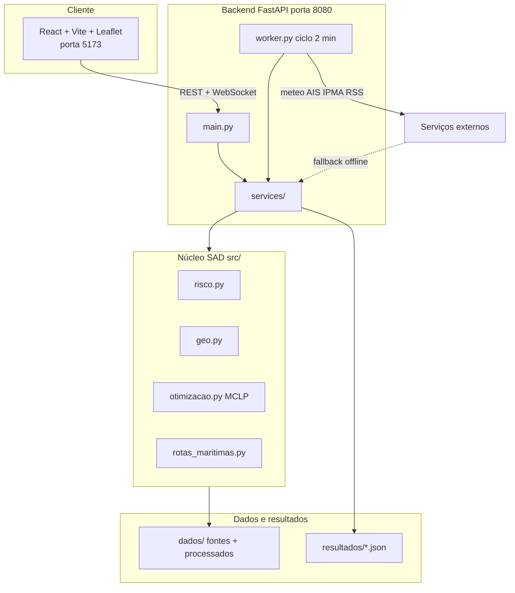

# Arquitectura — Plataforma SAD AR5

Visão técnica da aplicação executável em `plataforma/`, ligada ao núcleo analítico em `src/` e aos artefactos em `resultados/`.

## Diagrama de fluxo



## Componentes

| Camada | Pasta / ficheiro | Função |
|--------|-------------------|--------|
| Interface | `web/src/App.jsx` | Mapa, painel de patrulha, alertas, camadas |
| API | `api/main.py` | Endpoints REST, WebSocket, lifespan |
| Worker | `api/worker.py` | Meteo, AIS, IPMA, RSS a cada 2 min |
| Risco | `src/risco.py` + `services/risco_mapa.py` | Índice multi-ameaça por célula |
| Rotas | `services/patrulha_costeira.py` | Sortie, plano 24 h, reactivo |
| Frota | `services/frota.py` + `src/otimizacao.py` | MCLP, dimensionamento AR5 |
| Validação | `services/validacao_rota.py` | Score 0–100 por rota |
| Cache | `services/grelha_cache.py` | Grelha SAD em memória (singleton) |

## Endpoints principais

| Método | Rota | Módulo | Dados |
|--------|------|--------|-------|
| GET | `/api/estado` | `store.py` | Estado em memória |
| GET | `/api/risco/celulas` | `risco_mapa.py` | Grelha `src/` |
| GET | `/api/sad/respostas` | `sad_respostas.py` | `validacao.json` |
| GET | `/api/frota/dimensionar` | `frota.py` | Grelha + `validacao.json` |
| POST | `/api/rotas/sortie` | `patrulha_costeira.py` | OR-Tools TSP |
| POST | `/api/rotas/plano24h` | `patrulha_costeira.py` | 6 sectores costeiros |
| POST | `/api/rotas/reativo` | `patrulha_costeira.py` | Clique no mapa |
| WS | `/ws` | `ws_hub.py` | Alertas em tempo real |

## Métricas canónicas (runtime)

Valores de referência em `resultados/validacao.json`, expostos na UI via `/api/sad/respostas`:

| Métrica | Valor |
|---------|-------|
| Células alto risco (patrulha) | 274 |
| Frota AR5 (24 h / alto risco) | 9 |
| Ganho SAD vs aleatório | 2,13× (IC95 1,97–2,31) |
| Bases MCLP (k=2) | Porto + Portimão |

## Modos de operação

- **Online:** meteo Open-Meteo, IPMA, RSS, AISStream (se `AISSTREAM_API_KEY`).
- **Demo / offline:** navios simulados, cache local, `validacao.json` e camadas em `resultados/`.
- **Apresentação:** mapa leve (modo activo por defeito na UI).

## Testes

```bash
cd plataforma/api
source .venv/bin/activate
python smoke_test.py      # 23 verificações de endpoints + rotas
pytest tests/ -q          # unitários (MCLP, métricas, validação de rota)
```

CI: `.github/workflows/ci.yml` (smoke + pytest + build Vite).
